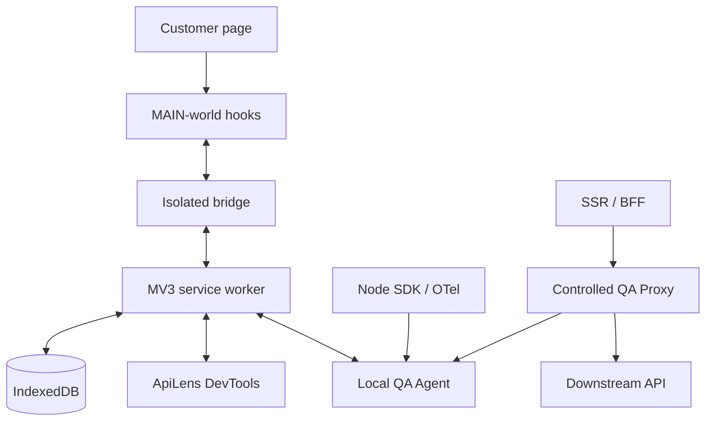

# Architecture

The extension directly observes only browser-visible traffic. Server telemetry comes from explicit instrumentation or the controlled proxy and retains its provenance. Uninstrumented server calls remain invisible.

Shared domain packages contain parsing, trace, mock, replay, diff, contract, security, insight and evidence logic. Browser and agent applications adapt them to Chrome APIs, IndexedDB, WebSocket, HTTP and filesystem boundaries.

The MV3 worker registers listeners synchronously and restores state through an initialization promise. Content hooks report a fingerprinted rule revision. Repair reinstalls hooks, synchronizes rules, and runs a synthetic request that must never reach the network.
