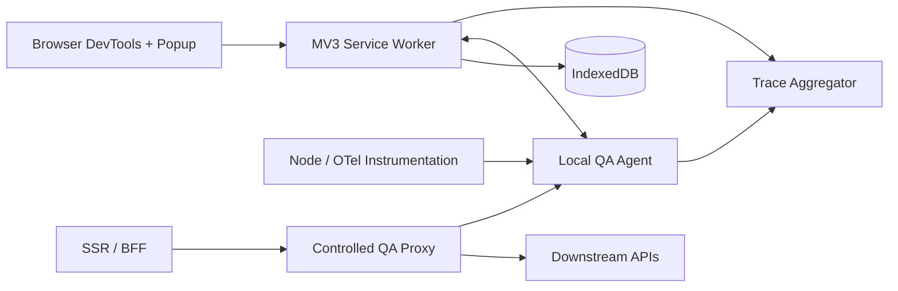

# ApiLens Technical Assessment

## 1. Existing architecture

ApiLens is a pnpm/Turborepo monorepo with a Manifest V3 Chromium extension, a localhost QA agent, an Express/Node SDK, demo applications, and domain packages for capture primitives, tracing, mocking, replay, security, evidence, insights, API diffing, and contract validation. The extension captures browser-visible traffic through MAIN-world Fetch/XHR hooks plus `webRequest`, stores sessions in IndexedDB, and connects to the local agent over WebSocket. The agent aggregates telemetry, performs replay/evidence work, and can run controlled reverse proxies. The Node SDK supplies Express middleware and outgoing HTTP instrumentation.

Traffic provenance is modeled explicitly:

- `page-hook` / `browser-network`: observed by the extension.
- `server-sdk`: reported by instrumented server code.
- `qa-proxy`: observed or manipulated by the controlled proxy.
- Uninstrumented remote server traffic: not visible.

## 2. Problems found

- The DevTools entry point was missing and is now functional, but its replacement has grown into a large component that should be decomposed by feature.
- Extension behavior has no automated tests; the test command previously accepted an empty suite.
- The Node HTTP interceptor test is a placeholder.
- The agent declares an integration-test command for a configuration file that does not exist.
- Docker Compose and setup documentation refer to retired control-plane/realtime applications.
- Root lint/build orchestration is inconsistent: many workspaces expose no lint/build script, and Turbo startup is fragile in restricted Windows environments.
- Replay, comparison, contracts, assertions, bookmarks, catalog and detailed trace primitives exist in packages/messages but are only partially exposed in the current UI.
- No first-class Playwright reporter/package exists despite evidence and session protocol support.
- The extension build previously emitted top-level `await`, which Chromium rejected for this MV3 worker; startup is now gated through an initialization promise and the build verifier guards the source boundary.

## 3. Technical limitations

- A browser extension cannot see arbitrary SSR/BFF/microservice calls. Those require Node/OTel instrumentation or routing through the QA proxy.
- MV3 workers are ephemeral; all durable state must remain in IndexedDB/storage and all initialization must be restart-safe.
- `webRequest` cannot provide complete response bodies. MAIN-world hooks provide bodies for page Fetch/XHR; the debugger fallback can mock but may display a browser warning.
- Page hooks cannot intercept service-worker/browser-internal requests or inject into `chrome://`, `brave://`, stores, and other restricted pages.
- CORS, CSP, frozen intrinsics and application code that replaces Fetch/XHR can constrain capture or mocking.

## 4. Recommended architecture

Keep the hybrid local-first architecture and formalize four adapters around shared domain packages:

The extension owns browser capture and UX. The agent owns server telemetry, proxying, filesystem export, and automation integration. Domain packages remain runtime-agnostic. OpenTelemetry/W3C trace context is the interoperability boundary.

## 5. Components to keep

- Strong shared request/trace/rule/session/protocol models.
- Mock, replay, trace, security, evidence, insight, diff and contract packages.
- Batched IndexedDB capture store and virtualized request table.
- MAIN/ISOLATED bridge with an end-to-end mock self-test.
- Localhost WebSocket agent and controlled proxy.
- Node middleware/outgoing-request instrumentation.

## 6. Components to refactor

- Split the DevTools panel into feature modules and a small shell/router.
- Move service-worker request routing into capability-focused controllers.
- Define a shared client facade for extension UI calls rather than raw message calls.
- Replace ad-hoc build checks with explicit extension, agent and integration verification scripts.
- Align docs, demos and Docker assets with the current agent architecture.

## 7. Components to replace

- Retired control-plane/realtime Docker topology.
- Placeholder and empty test suites.
- Any UI control that is disabled or decorative without a supported workflow.
- Proprietary-only server propagation where an OpenTelemetry-compatible adapter can be used.

## 8. New components required

- Playwright reporter/fixture package linked to agent sessions and test steps.
- Extension integration harness covering worker registration, capture, rule sync and export.
- Agent integration suite covering WebSocket, HTTP API and QA proxy.
- UI feature modules for replay/diff, contracts/assertions, catalog/bookmarks, session comparison, errors and performance insights.
- Import/export support for redacted mock bundles.

## 9. Security risks

- Captured credentials/PII leaking through storage, logs, replay or exports.
- Broad production mock rules or proxy routing.
- Local agent exposure beyond loopback or weak agent authentication.
- Replay of state-changing requests against unintended environments.
- Oversized/malformed payloads causing memory pressure or unsafe HTML rendering.

Mitigations: redact before persistence/broadcast/export, loopback-only defaults, explicit environment policy, bounded bodies/retention, escaped evidence rendering, token-authenticated agent sessions, and provenance labels.

## 10. Performance risks

- Thousands of events causing React churn or IndexedDB write amplification.
- Unbounded maps for in-flight requests/frame health.
- Large body capture and JSON rendering.
- Debugger fallback pausing all requests.

Current batching/virtualization/body limits are correct foundations. Add load tests, map expiry, lazy detail parsing, and performance budgets.

## 11. Migration strategy

1. **Reliability baseline:** make worker startup/build deterministic; add extension/agent/SDK tests and truthful documentation.
2. **Feature exposure:** modularize UI and connect existing replay, insights, contracts, catalog, bookmarks and comparison engines.
3. **Server tracing:** harden Node SDK, add OpenTelemetry adapters and proxy integration tests.
4. **Automation:** ship Playwright fixtures/reporter and live step markers through the agent protocol.
5. **Enterprise hardening:** performance budgets, accessibility/E2E tests, signed configuration, auditable environment policy and CI packaging.

This sequence preserves working capture/mocking while replacing gaps incrementally rather than rewriting stable domain logic.
