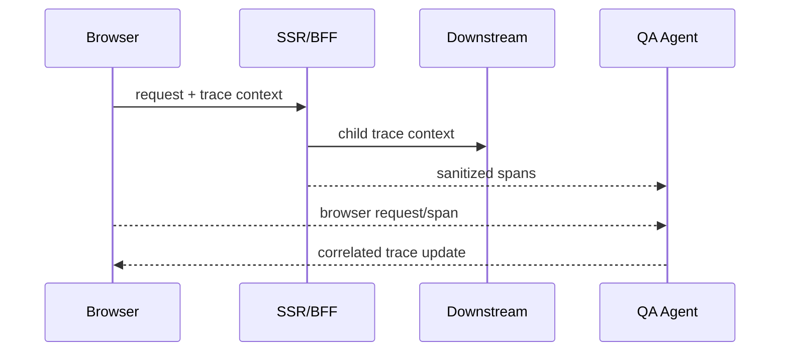

# Distributed Tracing

ApiLens correlates `traceparent`, `tracestate`, `x-request-id`, `x-correlation-id`, `request-id`, and B3 identifiers. Custom headers are configurable.

Install Node middleware before application routes and enable outgoing interception only in controlled QA execution. Prefer W3C/OpenTelemetry context. A missing instrumented hop appears as a gap; ApiLens does not invent it.
