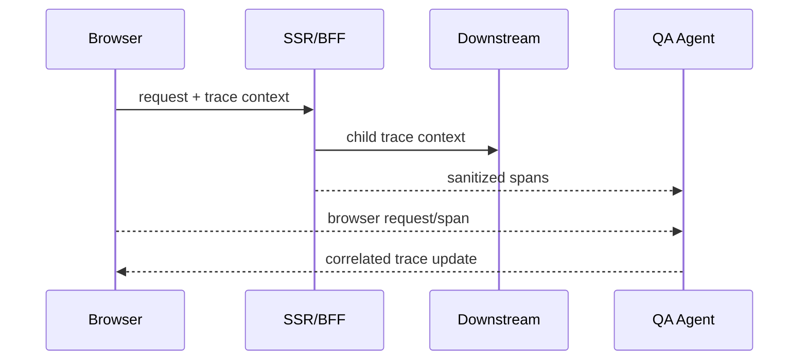

# Distributed Tracing

ApiLens correlates `traceparent`, `tracestate`, `x-request-id`, `x-correlation-id`, `request-id`, and B3 identifiers. Custom headers are configurable.

The diagram describes supported instrumented hops, not automatic coverage of every backend. The legacy `@apilens/node-sdk` is Express/http-only. The new [@apilens/next-sdk](../sdks/next/README.md) wraps Node-runtime App Router HTTP handlers and their native fetch calls. Each handler must be wrapped; Server Actions, SSR, DB calls and downstream internals are not automatically instrumented. Its telemetry uses authenticated `/v1/spans`. A missing instrumented hop appears as a gap; ApiLens does not invent it. The agent is required for server telemetry but remains optional for browser-only capture.
